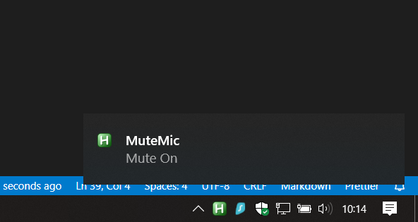

# [AutoHotkey] MuteMic

An AutoHotkey script which will mute and unmute the microphone globally.

---

## Notice

**You need the [AutoHotkey program](https://www.autohotkey.com) to edit, run and compile the scripts.**

[Click here to get started with AutoHotkey.](https://www.autohotkey.com/docs/Tutorial.htm)

This script has only been tested on Windows 10.

---

## Information

The script utilises the `Pause` button to mute/unmute the mic. You can change the hotkey in the script.
However, the microphone's volume does not change.

When you attempt to mute the microphone. A notification tray tip (see the screenshot below) will appear on the bottom right of the screen. If you don't see it you may need to enable notifications gobally or just for this script.

It will show 'Mute On' to tell that the microphone has been muted and 'Mute Off' when unmuted.

---

## Instructions

In the MuteMic.ahk script, you need to set the correct `mic_id` or you will get an error.

To get id of the microphone you want to mute/unmute.

1. Run the *getSoundDevices.ahk* script or *app/getSoundDevices.exe* app.

2. A window should appear, if successful. Find your microphone and get the id from the **'Mixer'** column. *Note: You may need to set your microphone volume to a random number like 56 to easily find it. (run the program again).*

3. Open the *MuteMic.ahk* script in a text/code editor and set `mic_id` to the id of your microphone.

4. Run the script by double clicking the file. Test it in a variety of situations to make sure it works. *Note that the id may change if you add/remove devices.*

5. *[Optional]* Compile the script to an executable. Right click on the script and select **'Compile Script'**. An exe file should appear in the same directory.

6. *[Optional]* You can run the exe file on startup. Open the Run Window (Win + R) and enter "shell:startup" and place the exe file in the start up folder. The program should now run after you login into your account.

---

## Screenshots

